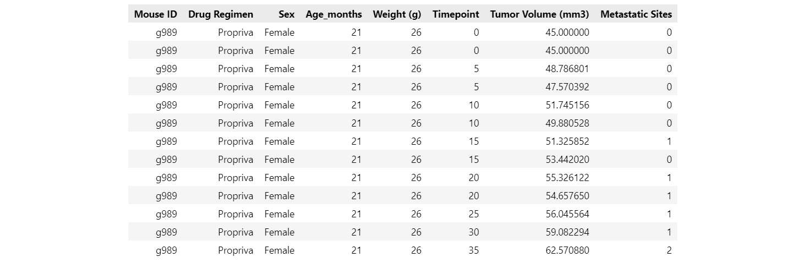
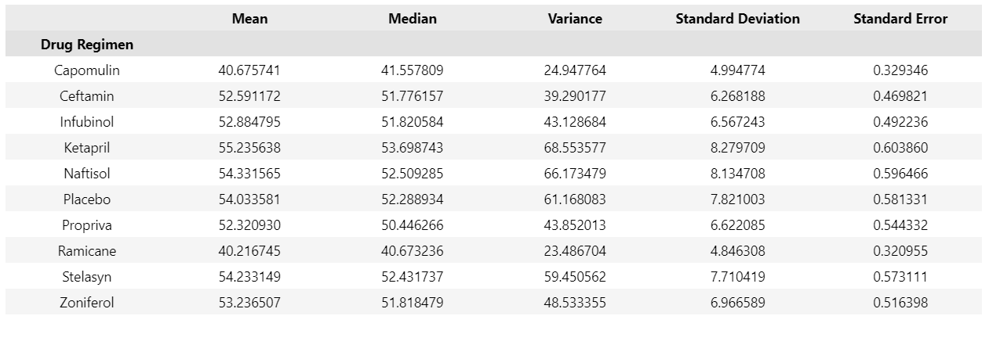

# Matplotlib Project - The Power of Plots

## Project Background

What good is data without a good plot to tell the story?

While your data companions rushed off to jobs in finance and government, you remained adamant that science was the way for you. Staying true to your mission, you've joined Pymaceuticals Inc., a burgeoning pharmaceutical company based out of San Diego. Pymaceuticals specializes in anti-cancer pharmaceuticals. In its most recent efforts, it began screening for potential treatments for squamous cell carcinoma (SCC), a commonly occurring form of skin cancer.

As a senior data analyst at the company, you've been given access to the complete data from their most recent animal study. In this study, 249 mice identified with SCC tumor growth were treated through a variety of drug regimens. Over the course of 45 days, tumor development was observed and measured. The purpose of this study was to compare the performance of Pymaceuticals' drug of interest, Capomulin, versus the other treatment regimens. You have been tasked by the executive team to generate all of the tables and figures needed for the technical report of the study. The executive team also has asked for a top-level summary of the study results.

## Tasks for this project are as follows:

### Data Cleaning:
* Step 1 - Remove Duplicates
* Before beginning the analysis we need to ensure the integrity of our data by checking it for duplicate time points and remove those  associated with that Mouse ID. After checking for duplicates we find that there is one Mouse ID with duplicate data out of the total 249 Mouse ID's. Having removed the duplicate data, there are now 248 total Mouse ID's to do our analysis on.

* Step 2 - Generate Summary Statistics
* Create a summary statistics table consisting of the mean, median, variance, standard deviation, and SEM of the tumor volume for each drug regimen.

* Step 3 - Summarize Findings
* This dataset includes numerous mouse drug trials, and while the small number of duplicates may seem insignificant—like a 
drop in the bucket—it’s important to ensure the dataset remains clean and consistent. Removing duplicates, even if they 
appear trivial, helps maintain the integrity of the analysis by ensuring all data points are unique and reliable. Although 
the single Mouse ID with duplicate entries in this case may not drastically impact the overall statistics, it's easy to 
imagine scenarios where duplicates could accumulate and skew results. Therefore, identifying and removing duplicates is not 
only good practice but a crucial step in data preprocessing.

### Create Charts:
* Step 1 - Create Bar Charts
* Generate a bar plot using both Pandas's `DataFrame.plot()` and Matplotlib's `pyplot` that shows the total number of measurements taken for each treatment regimen throughout the course of the study. It is encouraged to play with the formating to make the plots easier to read though these charts should essentially be identical when finished. 

* Pyplot Bar Chart

* Step 2 - Create Pie Charts
* Generate a pie plot using both Pandas's `DataFrame.plot()` and Matplotlib's `pyplot` that shows the distribution of female or male mice in the study. Like the bar charts, play with the formatting a little however the charts should be essentially identical when completed.

* Pyplot Pie Chart

*Step 3 - Summarize Findings
This drug trial was not biased toward any one drug or any gender.  There are slight differences in the numbers, but for the most part, the drugs were tested at about the same rate and evenly amongst gender.  I would say that for this trial to be trusted, it would need to administer the exact same amount of test measurements per drug with an even split amongst gender.  For example, if there were 230 tests administered of Capomulin, then there should be 230 tests measurements for all the other drugs.  Further, if there were 230 measurements per drug regimen, then there should be 115 tests per male and 115 tests per female across all drugs.  I would think that this would provide the most accurate picture of what these drugs are capable of and which one is more effective at achieving its goal and for which gender.

* Calculate the final tumor volume of each mouse across four of the most promising treatment regimens: Capomulin, Ramicane, Infubinol, and Ceftamin. Calculate the quartiles and IQR and quantitatively determine if there are any potential outliers across all four treatment regimens.

* Using Matplotlib, generate a box and whisker plot of the final tumor volume for all four treatment regimens and highlight any potential outliers in the plot by changing their color and style.

  **Hint**: All four box plots should be within the same figure. Use this [Matplotlib documentation page](https://matplotlib.org/gallery/pyplots/boxplot_demo_pyplot.html#sphx-glr-gallery-pyplots-boxplot-demo-pyplot-py) for help with changing the style of the outliers.

* Select a mouse that was treated with Capomulin and generate a line plot of tumor volume vs. time point for that mouse.

* Generate a scatter plot of mouse weight versus average tumor volume for the Capomulin treatment regimen.

* Calculate the correlation coefficient and linear regression model between mouse weight and average tumor volume for the Capomulin treatment. Plot the linear regression model on top of the previous scatter plot.

### Analysis
* Look across all previously generated figures and tables and write at least three observations or inferences that can be made from the data. Include these observations at the top of notebook.

Here are some final considerations:

* You must use proper labeling of your plots, to include properties such as: plot titles, axis labels, legend labels, _x_-axis and _y_-axis limits, etc.

* See the [starter workbook](Pymaceuticals/pymaceuticals_starter.ipynb) for help on what modules to import and expected format of the notebook.

## Hints and Considerations

* Be warned: These are very challenging tasks. Be patient with yourself as you trudge through these problems. They will take time and there is no shame in fumbling along the way. Data visualization is equal parts exploration, equal parts resolution.

* You have been provided a starter notebook. Use the code comments as a reminder of steps to follow as you complete the assignment.

* Don't get bogged down in small details. Always focus on the big picture. If you can't figure out how to get a label to show up correctly, come back to it. Focus on getting the core skeleton of your notebook complete. You can always revisit old problems.

* While you are trying to complete this assignment, feel encouraged to constantly refer to Stack Overflow and the Pandas documentation. These are needed tools in every data analyst's tool belt.

* Remember, there are many ways to approach a data problem. The key is to break up your task into micro tasks. Try answering questions like:

  * How does my DataFrame need to be structured for me to have the right _x_-axis and _y_-axis?

  * How do I build a basic scatter plot?

  * How do I add a label to that scatter plot?

  * Where would the labels for that scatter plot come from?

  Again, don't let the magnitude of a programming task scare you off. Ultimately, every programming problem boils down to a handful of bite-sized tasks.

* Get help when you need it! There is never any shame in asking. But, as always, ask a _specific_ question. You'll never get a great answer to "I'm lost."

### Copyright

UNIVERSITY OF OREGON: Data Analytics Boot Camp - Repository for project 5(Matplotlib Challenge)

Mathew Miller © 2021. All Rights Reserved.
