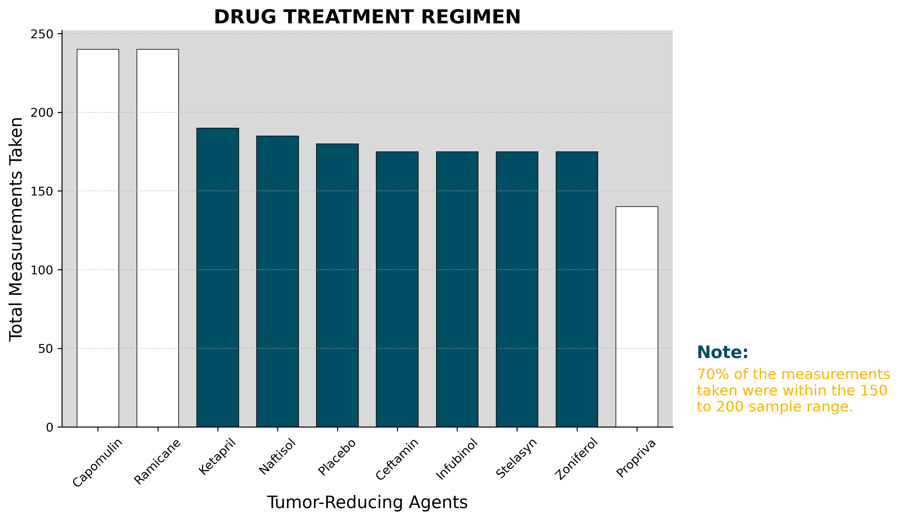
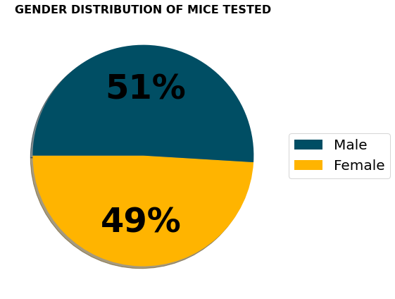
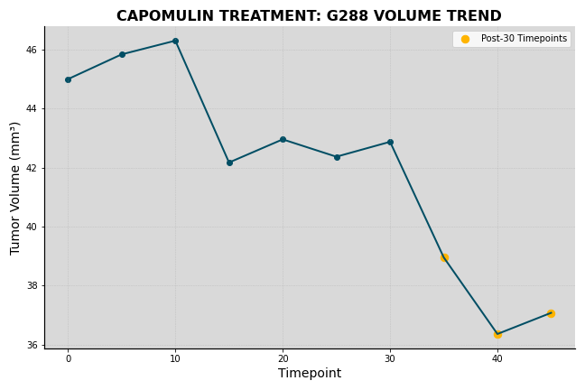
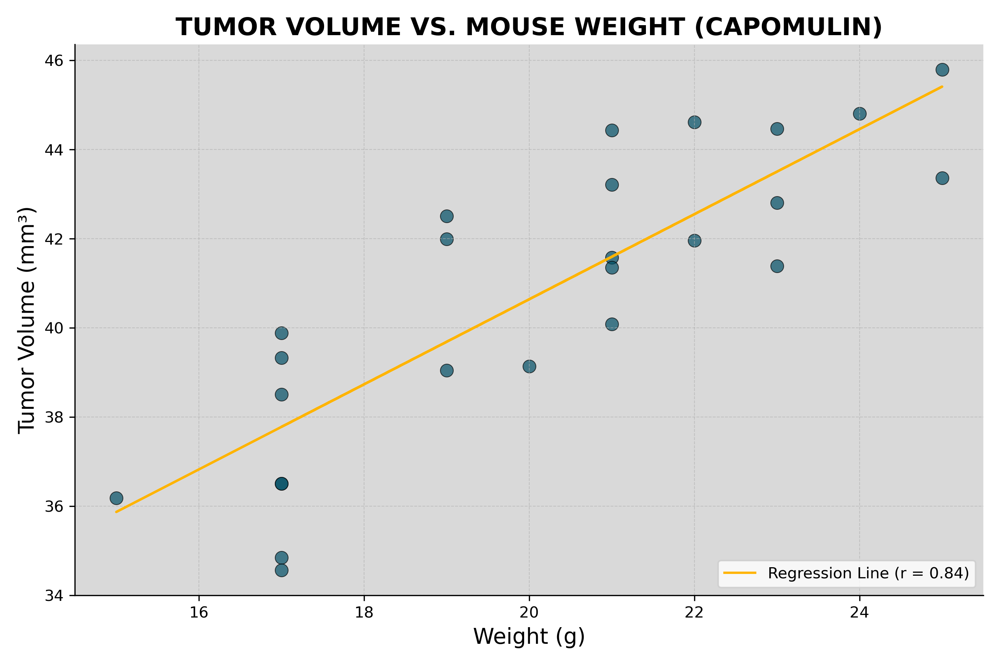

# Matplotlib Project - The Power of Plots
***
## Project Background

What good is data without a good plot to tell the story?

While your data companions rushed off to jobs in finance and government, you remained adamant that science was the way for you. Staying true to your mission, you've joined Pymaceuticals Inc., a burgeoning pharmaceutical company based out of San Diego. Pymaceuticals specializes in anti-cancer pharmaceuticals. In its most recent efforts, it began screening for potential treatments for squamous cell carcinoma (SCC), a commonly occurring form of skin cancer.

As a senior data analyst at the company, you've been given access to the complete data from their most recent animal study. In this study, 249 mice identified with SCC tumor growth were treated through a variety of drug regimens. Over the course of 45 days, tumor development was observed and measured. The purpose of this study was to compare the performance of Pymaceuticals' drug of interest, Capomulin, versus the other treatment regimens. You have been tasked by the executive team to generate all of the tables and figures needed for the technical report of the study. The executive team also has asked for a top-level summary of the study results.

---
## Tasks for this project are as follows:

### Data Cleaning:
* Remove Duplicates
* Generate Summary Statistics
* Summarize Findings
### Create Charts:
* Bar Chart
* Pie Chart
* Box Chart 
* Line Chart
* Scatter Chart
* Regression Line
---
### Data Cleaning:
#### Step 1 - Remove Duplicates

* Before beginning the analysis we need to ensure the integrity of our data by checking it for duplicate time points and remove those  associated with that Mouse ID. After checking for duplicates we find that there is one Mouse ID with duplicate data out of the total 249 Mouse ID's. Having removed the duplicate data, there are now 248 total Mouse ID's to do our analysis on.

#### Step 2 - Generate Summary Statistics
* Create a summary statistics table consisting of the mean, median, variance, standard deviation, and SEM of the tumor volume for each drug regimen.

#### Step 3 - Summarize Findings
* This dataset includes numerous mouse drug trials, and while the small number of duplicates may seem insignificant—like a 
drop in the bucket—it’s important to ensure the dataset remains clean and consistent. Removing duplicates, even if they 
appear trivial, helps maintain the integrity of the analysis by ensuring all data points are unique and reliable. Although 
the single Mouse ID with duplicate entries in this case may not drastically impact the overall statistics, it's easy to 
imagine scenarios where duplicates could accumulate and skew results. Therefore, identifying and removing duplicates is not 
only good practice but a crucial step in data preprocessing.
---
### Create Charts:
#### Step One - Create Bar Plot
* Generate a bar plot using Matplotlib's `pyplot` that shows the total number of measurements taken for each treatment regimen throughout the course of the study. It is encouraged to play with the formating to make the plots easier to read. 

* Pyplot Bar Chart

    

#### Step Two - Create Pie Plots
* Generate a pie plot using Matplotlib's `pyplot` that shows the distribution of female or male mice in the study. Like the bar charts, play with the formatting a little to make it easier to read, but stay consistent with the formating for uniformity.

* Pyplot Pie Chart (a)

    

* Generate another pie plot that shows the percentage of each of the drug regiments used in the study. Again, play with the formatting to make it easier to read but stay consistent with the previous charts formatting for uniformity.

* Pyplot Pie Chart (b)

    

#### Summarize Initial Findings
This drug trial was not biased toward any gender or drug regimen.  There are slight differences in the numbers, but for the most part, the drugs were tested at about the same rate and evenly amongst gender.  I would say that for this trial to be trusted, it would need to administer the exact same amount of test measurements per drug with an even split amongst gender.  For example, if there were 230 tests administered of Capomulin, then there should be 230 tests measurements for all the other drugs.  Further, if there were 230 measurements per drug regimen, then there should be 115 tests per male and 115 tests per female across all drugs.  I would think that this would provide the most accurate picture of what these drugs are capable of and which one is more effective at achieving its goal and for which gender.

#### Step Three - Create Box Plot
* Using Matplotlib, generate a box and whisker plot of the final tumor volume for all four treatment regimens and highlight any potential outliers in the plot by changing their color and style.

* Pyplot Box Chart

    

#### Step Four - Create Line Plot
* Select a mouse that was treated with Capomulin and generate a line plot of tumor volume vs. time point for that mouse.

* Pyplot Line Chart

    

#### Step Five - Create Scatter Plot
* Generate a scatter plot of mouse weight versus average tumor volume for the Capomulin treatment regimen.
* Pyplot Scatter Chart

    

#### Step Six - Create a Regression Line
* Generate a regression line plot that shows the same "mouse weight versus average tumor volume" plot points but with a regression line and without the size variable.
* Pyplot Regression Line Chart

    

* Calculate the correlation coefficient and linear regression model between mouse weight and average tumor volume for the Capomulin treatment. Plot the linear regression model on top of the previous scatter plot.

### Key Observations
Box Plot Insights
The box plots reveal variability in the effectiveness and distribution of tumor volume measurements across different drug regimens. Some treatments exhibit a narrow interquartile range (IQR), indicating more consistent results or potentially fewer data points. In contrast, others show wider or skewed distributions, suggesting greater variability in outcomes. The position of the median within the boxes—centered in some and skewed in others—also highlights differences in how tumor volumes responded to treatment across regimens.

Line Chart Trend
The line chart tracking tumor volume over time for a single mouse under Capomulin treatment displays a clear downward trend. This suggests a positive therapeutic effect, with tumor size consistently decreasing as the treatment progressed—an encouraging sign of Capomulin’s potential efficacy.

Regression Line Correlation
The scatter plot with a fitted regression line shows a strong positive correlation (r = 0.84) between mouse weight and tumor volume. This relationship may imply that heavier mice tend to develop larger tumors, reinforcing the need to control for weight in treatment assessments. The strength of this correlation also suggests that the data is well-suited for regression-based modeling.

### Project Analysis:Tumor Volume Study Using Matplotlib
This project focused on visualizing and analyzing tumor volume data using Matplotlib, Jupyter Notebook, and pandas. Key visual components included a line chart tracking tumor volume over time for a single subject, a bar chart summarizing drug regimen activity, and a customized box plot displaying the distribution of tumor volumes across treatment groups. Visual clarity and formatting were emphasized through thoughtful use of color, font sizing, chart annotations, and spine/gridline customization.

While there is room to extend this project—such as adding multiple time series for comparative analysis, building complete box plots for all drug regimens, or developing an interactive dashboard with hover-enabled data points—the current version effectively demonstrates core data visualization techniques. The charts are polished, clearly annotated, and convey meaningful insights into the dataset.

### Copyright

UNIVERSITY OF OREGON: Data Analytics Boot Camp - Repository for project 5 (Matplotlib Challenge)

Mathew Miller © 2021. All Rights Reserved.
